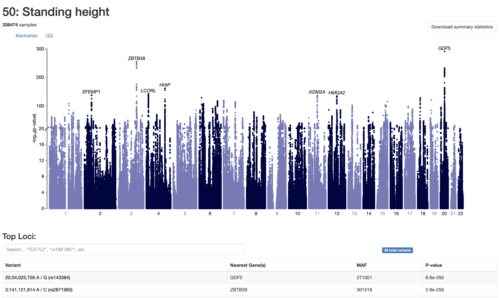

---
output:
  html_document: default
  word_document: default
  pdf_document: default
---
```{r, include = FALSE}
library(vcfR)
library(qqman)
library(tidyverse)
library(ggplot2)
theme_set(theme_minimal())

ottrpal::set_knitr_image_path()
BASE_WD = '/Coursework-Human-Genome-Variation' # SPECIFY BASE_WD 
knitr::opts_knit$set(root.dir = file.path(BASE_WD, "06-gwas"))
```

# Topics: Genome-wide association studies
### Intro

* Linkage - imputation and adjusting multiple-hypothesis testing
* QQ plots - p-values against the null distribution (of p-values)
* Manhattan plots - p-values across chromosomes

### Example
* VCF Format
* GWAS by lm()
* lm GWAS by plink


# Genome-wide association studies: Intro


**Genome-wide association studies (GWAS)** emerged ~20 years ago as a useful approach for discovering genetic variation that underlies variation in human traits.At their core, GWAS involve fitting **linear models** to test for relationships between variants and phenotypes using data from large samples of individuals.

As per material: "As genotypes of nearby variants are correlated, we can be _less_ strict with multiple testing correction. $\mathbf{5*10^{-8}}$ is an appropriate p-value threshold for GWAS in humans, given the amount of LD in human genomes."

<center>

).** Even without finding the causal variant, we can still discover the causal haplotype through genotyping variants in LD .](images/ld_gwas.jpg){width=75%}

</center>

## Imputation

Using a reference panel of haplotypes, unsequenced variants can be inferred
<center>


## QQ plots

One common visualization for GWAS results is a **QQ plot**, which compares the distribution of p-values in our results to a null distribution.

* Generate simulated p-values from a uniform distribution -- the number of simulated p-values should equal the number of actual p-values
* Sort both your real and simulated p-values in descending order
* Plot the first, second, third, etc. p-values, where
  * x-axis is the simulated value
  * y-axis is the actual value


<center>

).** QQ plots visualize the distriution of p-values compared to a null distribution.](images/qqplot.jpg){width=60%}

</center>

Interpretation:

1. **On the $\mathbf{x = y}$ line**: No association signal
2. **Above the $\mathbf{x = y}$ line**: Some association signal
3. **Below the $\mathbf{x = y}$ line**: Issue with our statistical test (ex: not appropriately adjusting for covariates)


## Manhattan plots

From height association data (**UK Biobank**, 500k individuals) using a [browser of GWAS results](https://pheweb.org/UKB-Neale/).

<center>



</center>

Note: Total proportions of variance explained are very small (<10%) despite minuscule p-values.


---


# Genome-wide association studies: Example

The data and exercises for this module were adapted from a [**GWAS workshop**](https://github.com/hwheeler01/GWAS_workshop) created by [**Heather Wheeler**](https://github.com/hwheeler01/GWAS_workshop) from Loyola University Chicago.

#### Aims:

1. Perform GWAS of a single SNP using linear regression.
2. Use PLINK to perform GWAS on all SNPs in a VCF.
3. Create and interpret common GWAS visualization plots.


#### Task:

Run a GWAS on resistance to two drugs (**GS451** and **CB1908**) in 1000 Genomes lymphblastoid cell lines on $\mathbf{IC_{50}}$, defined as the concentration of the drug at which the cells experience 50% viability.


### Data

GWAS requires information on both **genotype** and **phenotype** in the same individuals.

Genotypes: Yoruba population in the [1000 Genomes Project](https://mccoy-lab.github.io/hgv_modules/the-1000-genomes-project.html)
Phenotypes: Simulated


### Variant Call Format (VCF)


#### VCF header

```
##fileformat=VCFv4.2
##fileDate=20200327
##source=PLINKv1.90
##contig=<ID=1,length=247169191>
...
##contig=<ID=22,length=49503800>
##INFO=<ID=PR,Number=0,Type=Flag,Description="Provisional reference allele, may not be based on real reference genome">
##FORMAT=<ID=GT,Number=1,Type=String,Description="Genotype">
```

The final line of the header (marked with just one `#`) gives the names of the **data columns**. Note that there are over a hundred columns because each individual (`1001`, `1002`, etc.) has their own column.

```
#CHROM  POS     ID      REF     ALT     QUAL    FILTER  INFO    FORMAT  1001    1002    1003    1004    1005    1006    1007    1008    1009    1010    1011    1012    1013    1014    1015    1016    1017    1018    1019    1020    1021    1022    1023    1024    1025    1026    1027    1028    1029    1030    1031    1032    1033    1034
    1035    1036    1037    1038    1039    1040    1041    1042    1043    1044    1045    1046    1047    1048    1049    1050    1051    1052    1053    1054    1055
    1056    1057    1058    1059    1060    1061    1062    1063    1064    1065    1066    1067    1068    1069    1070    1071    1072    1073    1074    1075    1076
    1077    1078    1079    1080    1081    1082    1083    1084    1085    1086    1087    1088    1089    1090    1091    1092    1093    1094    1095    1096    1097
    1098    1099    1100    1101    1102    1103    1104    1105    1106    1107    1108    1109    1110    1111    1112    1113    1114    1115    1116    1117    1118
    1119    1120    1121    1122    1123    1124    1125    1126    1127    1128    1129    1130    1131    1132    1133    1134    1135    1136    1137    1138    1139
    1140    1141    1142    1143    1144    1145    1146    1147    1148    1149    1150    1151    1152    1153    1154    1155    1156    1157    1158    1159    1160
    1161    1162    1163    1164    1165    1166    1167    1168    1169    1170    1171    1172    1173    1174    1175    1176
```


#### VCF data

The **data** section of a VCF describes genetic variants.

The first 9 columns give information about the variant itself -- its position, the reference/alternative alleles, etc. The rest of the columns are sample-specific, and contain the individual's **genotype** at that variant.

```
1	558185	rs9699599	A	G	.	.	PR	GT	0/0	0/0	0/0	0/1	0/0	0/1	./.	0/0	0/0	0/0	0/1	0/0	0/0	0/0	0/0	0/1	0/0	0/1	0/0	0/0	0/0	0/0	0/0	0/0	0/0	./.	0/0	0/0	0/0	0/0	0/1	0/0	0/1	0/1	0/0	0/1	./.	0/1	0/1	0/0	0/0	0/0	0/0	0/0	0/0	0/0	0/0	0/0	0/0	0/0	0/0	0/0	0/0	0/0	0/0	0/0	0/0	0/0	0/0	0/0	0/0	0/0	0/0	0/1	0/0	0/1	0/0	0/0	0/0	0/1	0/0	0/1	0/0	0/0	0/0	./.	0/0	0/0	0/0	0/1	0/0	0/1	0/0	0/1	0/0	0/1	0/0	0/0	0/1	0/0	./.	./.	./.	./.	./.	./.	./.	./.	./.	./.	./.	./.	./.	./.	./.	./.	./.	./.	./.	./.	./.	./.	./.	./.	./.	./.	./.	./.	./.	./.	./.	./.	./.	./.	./.	./.	./.	./.	./.	./.	./.	./.	./.	./.	./.	./.	./.	./.	./.	./.	./.	./.	./.	./.	./.	./.	./.	./.	./.	./.	./.	./.	./.	./.	./.	./.	./.	./.	./.	./.	./.	./.	./.	./.	./.	./.	./.	./.	./.	./.	./.	./.	./.	./.	./.	./.
```

* `0/0`: homozygous reference (does not carry the variant)
* `0/1` or `1|0`: heterozygous
* `1/1`: homozygous alternate (both chromosomes have the variant)
* `./.`: Missing genotype (could not be confidently called)

The sample-specific columns often include additional genotype information, like the number of sequencing reads from the individual that support the reference vs. alternative alleles. The included fields are specified column 9 (**FORMAT**) (which in this case just reads `GT`, for "genotype").


#### vcfR: Reading in genotype data

Because VCF format can be hard to work with, we'll use the `vcfR` package to manipulate our genotype data.

```{r}
# load the VCF with vcfR
vcf <- read.vcfR("genotypes_subset.vcf")
```


#### Tidying VCF (vcfR2tidy)


```{r}
# extract first SNP, convert to tidy df, and get genotypes
test_snp_gt <- vcfR2tidy(vcf[1, ])$gt

```

Every row in the `test_snp_gt` dataframe is a different individual in the VCF.


### Allele dosage

Taking **dosage** of a minor allele (0, 1, or 2 copies) - lends to additive modeling

```{r}
# convert genotypes to counts (i.e., dosage) of minor allele
test_snp_gt <- test_snp_gt %>%
  # count number of Gs
  mutate(dosage = str_count(gt_GT_alleles, "G")) %>%
  drop_na()

head(test_snp_gt)
```

#### Phenotype data

Our phenotype for this GWAS is the $\mathbf{IC_{50}}$ -- the concentration of the GS451 drug that at which we observe 50% viability in cell culture.

* **`FID`** & **`IID`**: Family and individual IDs of the individual
* **`GS451_IC50`**: Measured $\mathrm{IC_{50}}$ for the drug of interest

```{r, warning=FALSE}
phenotypes <- read.table("GS451_IC50.txt", header = TRUE)

ggplot(data = phenotypes,
       aes(x = GS451_IC50)) +
  geom_histogram(bins=15)

gwas_data <- merge(test_snp_gt, phenotypes,
                   by.x = "Indiv", by.y = "IID")
```

Data looks approximately normally distributed - an assumption of linear regression, here used in GWAS.

## GWAS (for one variant)

#### Linear regression

If present, one may also include covariates such as sex, age, or ancestry as additional predictors to control for their potential confounding effects. 

```{r}
lm(data = gwas_data,
   formula = GS451_IC50 ~ dosage) %>%
  summary()
```

### GWAS of one SNP with PLINK

First, we'll replicate the GWAS that we did in R with just the first SNP of the VCF, `rs9699599`.

```{r, eval = FALSE}
# replicate first SNP association with PLINK
system("/Users/teddy/Applications/plink/plink --file genotypes --linear --allow-no-sex --snp rs9699599 --pheno GS451_IC50.txt --pheno-name GS451_IC50")
```

***
<details><summary> Details of the PLINK command </summary>

* `./plink`: Use the PLINK software
* `--file genotypes`: Genotype data files (`genotypes.map`, `genotypes.ped`) begin with the string "genotypes"
* `--linear`: Run a linear additive association test for each SNP
* `--allow-no-sex`: Include samples we don't have sex metadata for
* `--snp rs9699599`: Only run the analysis for a single SNP (`rs9699599`)
* `--pheno GS451_IC50.txt`: Phenotype data is located in a file called `GS451_IC50.txt`
* `--pheno-name GS451_IC50`: The column heading of the phenotype to use in the phenotype file is `GS451_IC50`

</details>
***

After running PLINK, we get an output file called `plink.assoc.linear`.

Now look at the output of the `plink.assoc.linear` output file that PLINK produced.

```{r, eval = FALSE}
snp1 <- read.table("plink.assoc.linear",
                   header = TRUE)

head(snp1)
```
```{r, echo = FALSE, warning = FALSE, message = FALSE}
# can't run plink on bookdown, so read in output file instead
snp1 <- read.table("https://drive.google.com/uc?export=download&id=1ifBh_xT4sw27h_1bUgWFifLrxfut0q68", header = TRUE)
head(snp1)
```

### GWAS of all SNPs with PLINK

Now let's allow PLINK to run the statistical tests for all SNPs by removing the `--snp` flag.

```{r, eval = FALSE}
system(command = "./plink --file genotypes --linear --allow-no-sex --pheno GS451_IC50.txt --pheno-name GS451_IC50")

results <- read.table(file = "plink.assoc.linear",
                      header = TRUE) %>%
  arrange(P)

head(results)
```

```{r, echo = FALSE, warning = FALSE, message = FALSE}
results <- read.table(file = "https://drive.google.com/uc?export=download&id=1yWYhOqwDmu1l2nsfxOQeDsvLFntKQAV0",
                      header = TRUE) %>%
  arrange(P)
head(results)
```


#### Plotting GWAS results

`qqman` package: `qq()` and `manhattan()`

```{r}
# qq plot using the P (pvalues) column
qq(results$P)
```

```{r}
# manhattan plot
manhattan(results)
```

SNPs with low p-values occur in peaks of multiple variants. These are not independent associations, but rather groups of variants in LD.


#### Top GWAS SNP

One common future direction for GWAS studies is following up on the top SNP(s). 

```{r, warning=FALSE}
# extract genotypes of the top SNP
top_snp <- vcfR2tidy(read.vcfR("top_snp.vcf"))
top_snp_gt <- top_snp$gt %>%
  drop_na()

# merge with phenotype data
gwas_data <- merge(top_snp_gt, phenotypes,
                   by.x = "Indiv", by.y = "IID")

# plot boxplots
ggplot(data = gwas_data) +
  geom_boxplot(aes(x = gt_GT_alleles,
                   y = GS451_IC50))
```

Other potential follow-up directions include:

* Investigating the genomic environment in the [UCSC Genome Browser](https://genome.ucsc.edu/cgi-bin/hgTracks?db=hg38)
* Looking at nearby haplotype structure with [LDproxy](https://ldlink.nci.nih.gov/?tab=ldproxy)
  * Note that the genotype data we're using come from the Yoruba population
* Using the [Geography of Genetic Variants](https://popgen.uchicago.edu/ggv/) browser to find the global allele frequencies of the variant
* Search for SNP in a phenotype database to see if there are other associations with it

---

## Assignment

GWAS of $\mathrm{IC_{50}}$ for the drug CB1908.

```{r, eval = FALSE}
# perform association test with PLINK
system(command = "./plink --file genotypes --linear --allow-no-sex --pheno CB1908_IC50.txt --pheno-name CB1908_IC50")

results <- read.table(file = "plink.assoc.linear", header = TRUE) %>%
  mutate(index = row_number()) %>%
  arrange(P)

qq(results$P)
manhattan(results)
```
```{r, echo = FALSE, warning = FALSE, message = FALSE}
results <- read.table(file = "https://drive.google.com/uc?export=download&id=1zdfHZ3JTQ6yOMNjo57KsoKgi_Y4Vd3tz",
                      header = TRUE) %>%
  arrange(P)

qq(results$P)

manhattan(results)
```

One hit reaches significance under 5e-8 (non-adjusted).

```{r}
results[1:2, ]
```

From looking it up in the UCSC Genome Browser, `rs10876043` lies within an intron of the _DIP2B_ gene. Finally, we plot this SNP's genotype stratified by phenotype, using `top_snp_hw.vcf`.

```{r, warning=FALSE}
# extract top SNP and convert to tidy df
top_snp <- vcfR2tidy(read.vcfR("top_snp_hw.vcf"))
# get genotype dataframe
top_snp_gt <- top_snp$gt %>%
  drop_na()

# read in phenotype dataframe
phenotypes <- read.table("CB1908_IC50.txt", header = TRUE)

# merge genotype and phenotype info
gwas_data <- merge(top_snp_gt, phenotypes,
                   by.x = "Indiv", by.y = "IID")

# plot genotype by phenotype boxplots
ggplot(data = gwas_data) +
  geom_boxplot(aes(x = gt_GT_alleles,
                   y = CB1908_IC50))
```