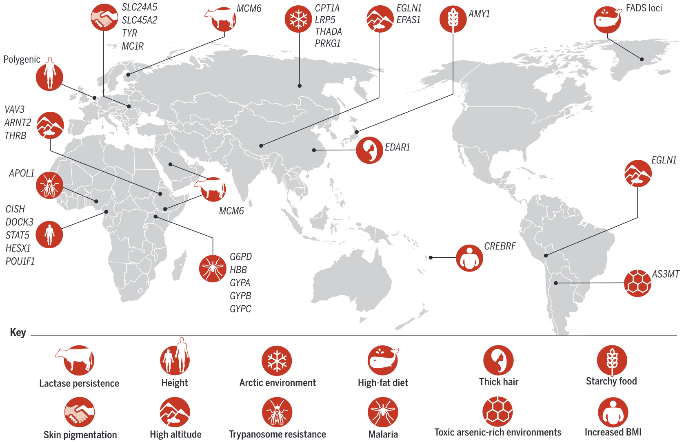

---
output:
  html_document: default
  word_document: default
  pdf_document: default
---
```{r, include = FALSE}
ottrpal::set_knitr_image_path()

BASE_WD = '/Users/teddy/Documents/Coursework-Human-Genome-Variation/' # SPECIFY BASE_WD 
knitr::opts_knit$set(root.dir = file.path(BASE_WD, '08-selection'))

#install.packages("BiocManager")
#devtools::install_version('rvcheck',version='0.1.8') # required for install on R < 4.0
#BiocManager::install("ggtree")

library(tidyverse)
library(vcfR) 
library(ggtree) # an R package for visualizing trees associated with Population Branch Statistic (PBS) outliers
```

# Identifying selection

Definition and application of approaches noted in [Going global by adapting local: A
review of recent human adaptation](https://doi.org/10.1126/science.aaf5098)

<center>
{width=85%}
</center>

### Approaches:

* $\mathrm{F_{ST}}$
* PBS: Population Branch Statistic
* LSBL: Locus-Specific Branch Length
* EHH: Extended haplotype homozygosity
  * iHS: Integrated haplotype statistic
  * XP-EHH: Cross-population EHH

### Terms: 
* Hitchhiking: An increase in proximate variant expression due to selection for a haplotype
* Selective sweep: Decline in genetic diversity due to the spread or fixation of a selected-for variant


<center>

).** The history of human migrations.](images/peopling.jpg){width=85%}

</center>


## Fixation index (F~ST~)

$\mathrm{F_{ST}}$ describes the extent to which an allele varies within subpopulations. It reflects the joint effects of drift, migration, mutation and selection. 

* $\mathbf{H_T}$: The total frequency of heterozygotes
* $\mathbf{mean(H_S)}$: The mean of frequencies of heterozygotes of each subgroup
* where $H = 2pq$, and $p$ and $q$ are the frequencies of the two alleles at a site

$$
\textrm{F}_{ST} = \frac{H_T - \textrm{mean}(H_S)}{H_T}
$$

* $\mathrm{F_{ST}} = 0$: No variation among subpopulations
* $\mathrm{F_{ST}} = 1$: Variation exclusively among subpopulations


This also comes out to:
$$
F_{ST} = \frac{\text{Var}(p)}{p(1 - p)}
$$
For allele frequencies p, where $\mathrm{Var_{p}}$

Reference: [Review](https://pubmed.ncbi.nlm.nih.gov/19687804/)


From the 1000 Genomes Project:

```{r}
vcf <- read.vcfR(file = "random_variable_sites.vcf.gz", verbose=FALSE)

metadata <- read.table("integrated_call_samples.txt",
                       header = TRUE)

pop_labels <- as.factor(metadata$superpop)

gst_results <- genetic_diff(vcf, pop_labels) %>%
  arrange(-Gst)

ggplot(data = gst_results,
       aes(x = Gst)) +
  geom_histogram(bins=1000) +
  scale_y_continuous(trans="log10")
```

(Almost) exponential decay, with most genes below a 1% $\mathrm{F_{ST}}$

### Analyzing G~ST~ hits in [**GGV**](https://popgen.uchicago.edu/ggv/?data=%221000genomes%22)

```{r}
gst_results[1, ]
```

<center>


</center>


## Population branch statistic (PBS)

For distances ($\mathbf{T}$) given pairwise $\mathbf{F_{ST}}$:

$$
T = -\mathrm{ln}(1 - \textrm{F}_{ST})
$$

$$
\textrm{PBS} = \frac{\textrm{T}_{AB} + \textrm{T}_{AC} - \textrm{T}_{BC}}{2}
$$

#### Explanation (of T: drift time): 

* $F_{ST}$ measures the **fractional reduction of heterozygosity within subpopulations relative to total heterozygosity**:

  $$F_{ST} = \frac{H_T - H_S}{H_T}$$

(Under pure drift) within-population heterozygosity decays exponentially:

  $$H_t = H_0 e^{-t/(2N_e)}$$
  $$F_{ST} \approx 1 - e^{-t/(2N_e)}$$

  $$T = -\ln(1 - F_{ST})$$

  yields an additive quantity proportional to time over $2N_e$, which behaves like a **branch length (drift time)** and is used in the Population Branch Statistic (PBS).


### PBS Example: Allele origin among three populations

Using: [Tucci, S. et al. (2018). Evolutionary history and adaptation of a human pygmy population of Flores Island, Indonesia.](https://science.sciencemag.org/content/361/6401/511.abstract).

Flores Island was home to fossils of the archaic hominin species _**Homo floresiensis**_, also called "hobbits" because their skeletons are 3 ft. tall. It's thought that _H. floresiensis_ lived there until just 40k-30k years ago, overlapping with modern humans.

This study collected samples from individuals who currently live on Flores Island and scanned their genomes for evidence of natural selection. They calculated **PBS** between:

* The Rampasasa (**RPS**) population from Flores
* A Han Chinese (**CHB**) population
* A Melanesian population from Papua New Guinea (**PNG**)

<center>

{width=60%}

</center>

Load pre-calculated pairwise $\textrm{F}_{ST}$ between the Rampasasa, Han Chinese, and Papua New Guinea populations (for chromosome 11). Rows mark SNPs at 'pos', which are essentially unique in this data.

```{r}
fst_results <- read.table("fst_results.txt.gz", header = TRUE)
head(fst_results)
```


```{r}
pbs <- fst_results %>%
  mutate(T_rps_chb = -log(1 - fst.rps.chb),
         T_rps_png = -log(1 - fst.rps.png),
         T_png_chb = -log(1 - fst.png.chb)) %>%
  mutate(pbs = ((T_rps_png + T_rps_chb) - (T_png_chb)) / 2) %>%
  arrange(-pbs)

ggplot(data = pbs,
       aes(x = pos, y = pbs)) +
  geom_point()
```

As evidence of positive selection, we are interested in both the height of the peaks in the plot, as well as the number of SNPs that comprise each peak (which is a proxy for haplotype length).


#### Top PBS hits

Use the [UCSC Genome Browser](https://genome.ucsc.edu/cgi-bin/hgTracks?db=hg19) to look up the top two PBS peaks. (We're using the **hg19** browser here because this data was generated with the hg19 reference genome.)

The top chr11 peak doesn't seem to overlap with any genes, but is closest to _KIRREL3_.

The second chr11 peak overlaps with the fatty acid desaturase gene cluster (*FADS1*, *FADS2*, and *FADS3*), which have [previously been implicated](https://science.sciencemag.org/content/349/6254/1343.short) as targets of independent episodes of positive selection in human populations.

<center>


</center>


#### Plotting PBS trees

Another useful way to visualize PBS is by comparing trees for the top PBS outliers to the genome-wide average tree. Run the code blocks below to plot these trees:

```{r, warning=FALSE}
# create average tree
tr_mean <- rtree(n = 3,
                 rooted = FALSE,
                 br = c(mean(pbs$T_rps_png),
                        mean(pbs$T_rps_chb),
                        mean(pbs$T_png_chb)))

# plot average tree
ggtree(tr_mean, layout = "daylight") +
  geom_treescale(width = 0.1) +
  geom_tiplab(label = c("RPS", "PNG", "CHB"))
```

```{r, warning=FALSE}
# create tree for top snp
tr_top <- rtree(n = 3,
                rooted = FALSE,
                br = c(pbs[1,]$T_rps_png,
                       pbs[1,]$T_rps_chb,
                       pbs[1,]$T_png_chb))

ggtree(tr_top, layout = "daylight") +
  geom_treescale(width = 0.1) +
  geom_tiplab(label = c("RPS", "PNG", "CHB"))
```


## LSBL: Locus-Specific Branch Length

The 1st Taylor series term (around 0) of drift-time $\mathrm{T}$ gives $\mathrm{F_{ST}}$

$$- \ln(1 - F_{ST}) \approx F_{ST}$$
Justifying this approximation, most human $\mathrm{F_{ST}}$ are small (below 1%, generally <15%)

$$LSBL_i = \frac{1}{2} \left( F_{ST}^{i,j} + F_{ST}^{i,k} - F_{ST}^{j,k} \right)$$


## Extended haplotype homozygosity

EHH captures long haplotypes that result from a selective sweep but, unlike prior statistics, can discriminate:

* Selection, subpopulation-specific, would manifest as a high and local PBS/FST
* Random fixation (from genetic drift), subpopulation-specific, would manifest in high PBS/FST
* Background (linked purifying) selection generates AF variation, inflating PBS/FST: removal of neutral alleles linked to deleterious mutations
* Subpopulation structures (non-random mating, founder events) inflate FST/PBS (broad, detectable by clustering)


**Extended haplotype homozygosity (EHH)** is the probability that any two haplotypes in a population are homozygous at SNPs in specific genomic region. EHH is elevated in regions under historical selection relative to drift.

<center>


</center>


### EHH: Phylogeny-like plot
<center>

{width=80%}

</center>

<center>


</center>

## iHS (Integrated haplotype statistic)

The **integrated haplotype statistic (iHS)** is ln of derived divided by ancestral EHH curve integrals. 

<center>


</center>

## XP-EHH is iHS between contemporaneous populations


### The PopHuman browser

EHH and iHS exist genome-wide for all of the populations in the 1000 Genomes dataset, available from the [**PopHuman browser**](https://pophuman.uab.cat/).

Ex: Look up the lactase (**_LCT_**) gene in the search bar, and then click `Select tracks` in the upper left-hand corner to choose:

* **iHS** for the CEU (European) population
* **pi** for the CEU population. This is a measure of nucleotide diversity, which we expect to be low in a region under historical selection

<center>


</center>

Note that if we compare both of these statistics to the genome-wide mean (yellow lines), we can see how dramatically they deviate from expectations in this genomic region.
